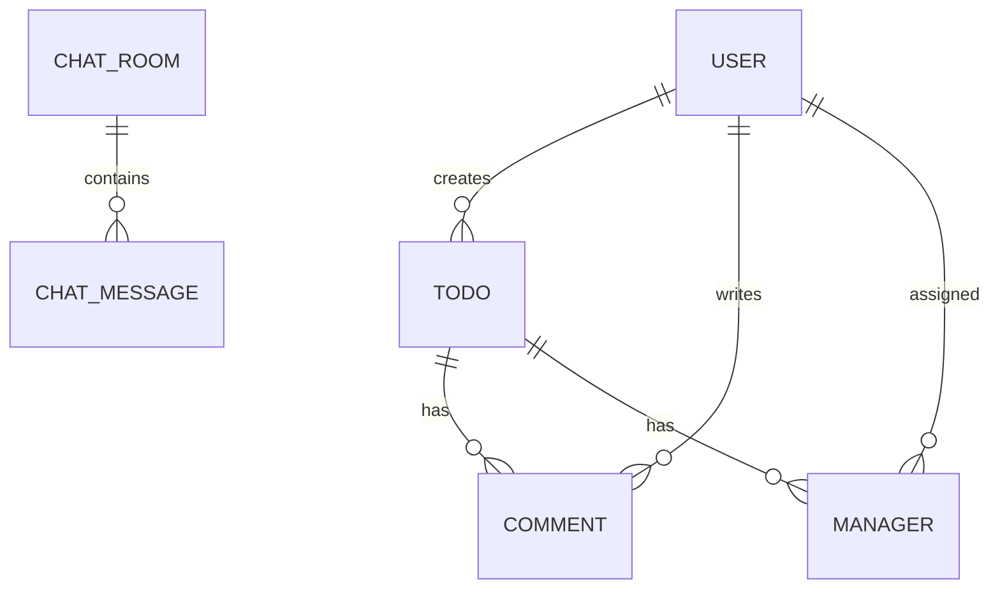

# Spring Plus

JWT 인증 기반 일정 관리 API입니다. 일정·댓글·담당자 관리, 조건 검색, 관리자 권한 변경, 요청 이력 저장과 WebSocket 실시간 채팅을 제공합니다.

## 주요 기능

- Spring Security + JWT 기반 무상태 인증/인가
- BCrypt 비밀번호 암호화 및 `USER`/`ADMIN` 권한 분리
- 일정 생성·단건/페이지 조회와 외부 API 기반 오늘 날씨 저장
- JPQL 기반 날씨·수정일 검색
- QueryDSL 기반 제목·생성일·담당자 닉네임 동적 검색
- 댓글과 일정 담당자 등록·조회·삭제
- 담당자 등록 성공/실패 이력을 독립 트랜잭션으로 저장
- AOP 기반 관리자 API 접근 로그
- WebSocket/STOMP 기반 채팅, 입력 상태 알림, 메시지 저장

## 기술 스택

| 구분 | 기술 |
| --- | --- |
| Language | Java 17 |
| Framework | Spring Boot 3.3.3 |
| API | Spring Web, Validation |
| Security | Spring Security, JWT, BCrypt |
| Database | MySQL, Spring Data JPA, QueryDSL 5 |
| Realtime | WebSocket, STOMP, SockJS |
| Test | JUnit 5, Spring Boot Test, Spring Security Test |
| Build | Gradle Wrapper |

## 구조

```text
src/main/java/org/example/expert
├── config       # Security, JWT, WebSocket, QueryDSL, 예외 처리
├── client       # 외부 날씨 API 연동
├── aop          # 관리자 요청 로깅
└── domain
    ├── auth     # 회원가입·로그인
    ├── user     # 사용자·권한
    ├── todo     # 일정·동적 검색
    ├── comment  # 댓글
    ├── manager  # 일정 담당자
    ├── log      # 담당자 등록 이력
    └── chat     # 채팅방·메시지
```

기본 요청 흐름은 `Controller → Service → Repository → DB`이며, API 응답은 Entity 대신 DTO를 사용합니다.



## 실행 방법

### 1. 사전 준비

- JDK 17
- MySQL 8.x

예제 설정을 복사한 뒤 로컬 환경에 맞게 DB 정보와 JWT 키를 변경합니다.

```bash
cp src/main/resources/application.properties.example src/main/resources/application.properties
```

```sql
CREATE DATABASE expert_db;
```

기본 DB 설정은 `src/main/resources/application.properties`에 있습니다. 운영 환경에서는 다음 환경 변수로 값을 덮어쓰는 방식을 권장합니다.

```bash
export SPRING_DATASOURCE_URL='jdbc:mysql://localhost:3306/expert_db'
export SPRING_DATASOURCE_USERNAME='root'
export SPRING_DATASOURCE_PASSWORD='your-password'
export JWT_SECRET_KEY='Base64로 인코딩한 32바이트 이상의 키'
```

### 2. 실행

```bash
./gradlew bootRun
```

서버 기본 주소: `http://localhost:8080`

일정 생성 시 `https://f-api.github.io/f-api/weather.json`에서 오늘 날씨를 조회하므로 외부 네트워크 연결이 필요합니다.

## 인증

회원가입 또는 로그인 응답의 `bearerToken`을 보호 API의 헤더에 전달합니다. 토큰 유효시간은 60분입니다.

```http
Authorization: Bearer <JWT>
```

회원가입 예시:

```bash
curl -X POST http://localhost:8080/auth/signup \
  -H 'Content-Type: application/json' \
  -d '{
    "email": "user@example.com",
    "password": "password123",
    "userRole": "USER",
    "nickname": "spring-user"
  }'
```

## REST API

`공개` 표시가 없는 API는 JWT 인증이 필요합니다. `/admin/**`는 `ADMIN` 권한이 필요합니다.

| 기능 | Method | Endpoint | 인증 |
| --- | --- | --- | --- |
| 회원가입 | POST | `/auth/signup` | 공개 |
| 로그인 | POST | `/auth/signin` | 공개 |
| 사용자 조회 | GET | `/users/{userId}` | 필요 |
| 비밀번호 변경 | PUT | `/users` | 필요 |
| 사용자 권한 변경 | PATCH | `/admin/users/{userId}` | ADMIN |
| 일정 생성 | POST | `/todos` | 필요 |
| 일정 목록 조회 | GET | `/todos?page=1&size=10&weather=&startDate=&endDate=` | 필요 |
| 일정 상세 조회 | GET | `/todos/{todoId}` | 필요 |
| 일정 동적 검색 | GET | `/todos/search?keyword=&startDate=&endDate=&nickname=&page=1&size=10` | 필요 |
| 댓글 등록 | POST | `/todos/{todoId}/comments` | 필요 |
| 댓글 목록 조회 | GET | `/todos/{todoId}/comments` | 필요 |
| 담당자 등록 | POST | `/todos/{todoId}/managers` | 필요 |
| 담당자 목록 조회 | GET | `/todos/{todoId}/managers` | 필요 |
| 담당자 삭제 | DELETE | `/todos/{todoId}/managers/{managerId}` | 필요 |
| 채팅 사용자 목록 | GET | `/api/users` | 공개 |
| 채팅방 목록/생성 | GET, POST | `/api/chat/rooms` | 공개 |
| 채팅 내역 조회 | GET | `/api/chat/rooms/{roomId}/messages?size=50` | 공개 |

날짜 검색값은 ISO-8601 형식입니다. 예: `2026-06-01T00:00:00`

## 실시간 채팅

애플리케이션 실행 후 `http://localhost:8080/chat-test.html`에서 테스트할 수 있습니다.

| 구분 | 경로 |
| --- | --- |
| SockJS 연결 | `/ws` |
| 메시지 발행 | `/pub/chat.send` |
| 입력 상태 발행 | `/pub/chat.typing` |
| 메시지 구독 | `/sub/chat/{roomId}` |
| 입력 상태 구독 | `/sub/chat/{roomId}/typing` |

STOMP `CONNECT` 프레임에는 `Authorization: Bearer <JWT>` 헤더가 필요합니다.

메시지 발행 본문:

```json
{
  "roomId": 1,
  "content": "안녕하세요"
}
```

## 테스트

```bash
./gradlew test
```

테스트 결과 보고서: `build/reports/tests/test/index.html`
